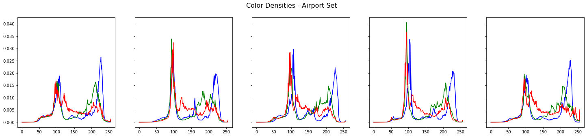
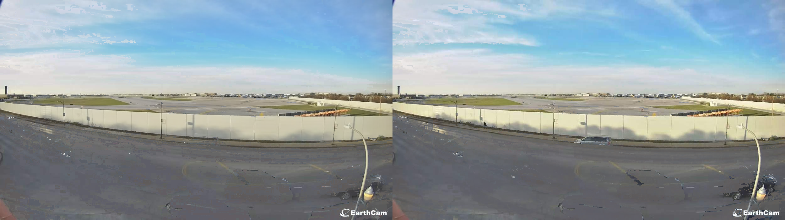
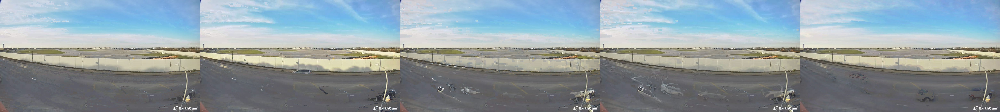
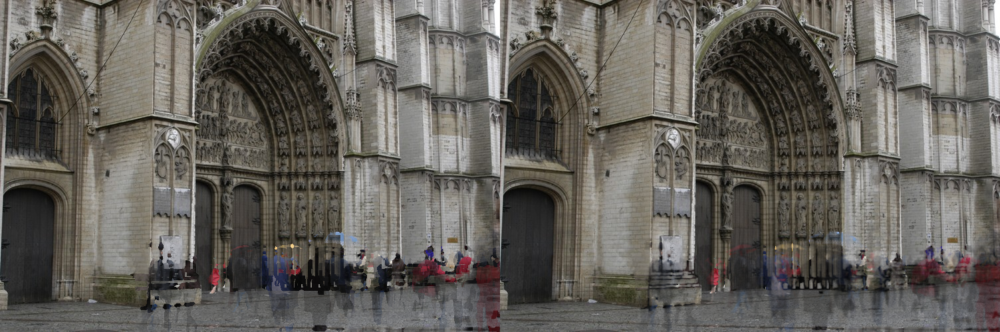

# Computer Vision - Project 1
Image representation and preprocessing - programmatic photomontage - extracting background from set of images with moving objects

---
- Bartosz Stachowiak
- Andrzej Kajdasz


### TOC
- 1. [Image Analysis](#1-image-analysis)
  - a. [Initial Observations](#a-initial-observations)
  - b. [Images Covering](#b-images-covering)
  - c. [Images Color Density](#c-images-color-density)
  - d. [Images Statistics](#d-images-statistics)
- 2. [Purifiaction](#2-purification)
  - a. [Histogram Method](#a-histogram-method)
  - b. [Mean Pixel Distance and Channel Intensity Method](#b-mean-pixel-distance-and-channel-intensity-method)
  - c. [Comparison and Tweaks](#c-comparison-and-tweaks)
  - d. [Bonus - Greedy Method](#d-bonus---greedy-method)
- 3. [Failed Attempts](#3-failed-attempts)
  - a. [Edge Weight Method](#a-edge-weight-method)
  - b. [Dynamic pixel substituion with edge sum heuristic](#b-dynamic-pixel-substituion-with-edge-sum-heuristic)

### Imports & Utilities


```python
%matplotlib inline
import io

import cv2
import numpy as np
import PIL.Image

from matplotlib import pyplot as plt
from IPython.display import Image, display

from transform import purifier, weights, masks, stat
```


```python
def showarray(img, converted: int | None = cv2.COLOR_BGR2RGB) -> None:
    if converted is not None:
        img = cv2.cvtColor(img, converted)
    f = io.BytesIO()
    PIL.Image.fromarray(np.clip(img.astype(np.uint8), 0, 255)).save(f, "png")
    display(Image(data=f.getvalue()))

def show_image_color_density_plot(image: np.ndarray, ax: plt.Axes) -> None:
    histograms = stat.create_image_histogram(image).T
    densities = histograms / np.repeat(np.sum(histograms, axis=1), 256).reshape(3, 256)

    ax.plot(densities[0], color="blue")
    ax.plot(densities[1], color="green")
    ax.plot(densities[2], color="red")
```

### Image Download


```python
!wget -O cathedral.zip http://grail.cs.washington.edu/projects/photomontage/data/cathedral.zip && unzip -o cathedral.zip
!wget -O my_dataset.zip https://drive.google.com/uc?id=1efVpB_5P2T9rjk__7QqGZ9eu7Usxla8p&export=download
!unzip my_dataset.zip  

!wget -O example_images.zip https://drive.google.com/uc?id=1y4Oht73Sx2BurzkfGOltuavuCMCHTwQw&export=download 
!unzip example_images.zip
```

    Archive:  cathedral.zip
      inflating: cathedral/d001.jpg      
      inflating: cathedral/d002.jpg      
      inflating: cathedral/d003.jpg      
      inflating: cathedral/d004.jpg      
      inflating: cathedral/d005.jpg      
      inflating: cathedral/result.png    
    

    --2022-11-10 22:21:29--  http://grail.cs.washington.edu/projects/photomontage/data/cathedral.zip
    Resolving grail.cs.washington.edu (grail.cs.washington.edu)... 128.208.5.93
    Connecting to grail.cs.washington.edu (grail.cs.washington.edu)|128.208.5.93|:80... connected.
    HTTP request sent, awaiting response... 200 OK
    Length: 1342082 (1,3M) [application/zip]
    Saving to: 'cathedral.zip'
    
         0K .......... .......... .......... .......... ..........  3% 62,9K 20s
        50K .......... .......... .......... .......... ..........  7% 67,8K 19s
       100K .......... .......... .......... .......... .......... 11% 97,7K 16s
       150K .......... .......... .......... .......... .......... 15% 89,0K 14s
       200K .......... .......... .......... .......... .......... 19% 94,5K 13s
       250K .......... .......... .......... .......... .......... 22%  102K 12s
       300K .......... .......... .......... .......... .......... 26%  124K 11s
       350K .......... .......... .......... .......... .......... 30%  124K 10s
       400K .......... .......... .......... .......... .......... 34%  141K 9s
       450K .......... .......... .......... .......... .......... 38%  119K 8s
       500K .......... .......... .......... .......... .......... 41%  162K 8s
       550K .......... .......... .......... .......... .......... 45%  156K 7s
       600K .......... .......... .......... .......... .......... 49%  156K 6s
       650K .......... .......... .......... .......... .......... 53%  155K 6s
       700K .......... .......... .......... .......... .......... 57%  216K 5s
       750K .......... .......... .......... .......... .......... 61%  280K 4s
       800K .......... .......... .......... .......... .......... 64%  172K 4s
       850K .......... .......... .......... .......... .......... 68%  281K 3s
       900K .......... .......... .......... .......... .......... 72%  285K 3s
       950K .......... .......... .......... .......... .......... 76%  356K 2s
      1000K .......... .......... .......... .......... .......... 80%  414K 2s
      1050K .......... .......... .......... .......... .......... 83%  375K 2s
      1100K .......... .......... .......... .......... .......... 87%  321K 1s
      1150K .......... .......... .......... .......... .......... 91%  487K 1s
      1200K .......... .......... .......... .......... .......... 95%  378K 0s
      1250K .......... .......... .......... .......... .......... 99%  430K 0s
      1300K ..........                                            100%  607K=8,4s
    
    2022-11-10 22:21:38 (155 KB/s) - 'cathedral.zip' saved [1342082/1342082]
    
    
    CreateFile() error 32 when trying set file time
    --2022-11-10 22:21:38--  https://drive.google.com/uc?id=1efVpB_5P2T9rjk__7QqGZ9eu7Usxla8p
    Resolving drive.google.com (drive.google.com)... 142.250.75.14
    Connecting to drive.google.com (drive.google.com)|142.250.75.14|:443... connected.
    HTTP request sent, awaiting response... 303 See Other
    Location: https://doc-0s-04-docs.googleusercontent.com/docs/securesc/ha0ro937gcuc7l7deffksulhg5h7mbp1/243p28aumj5mqs938otmkp8pb1rurpbh/1668115275000/14858517474256966931/*/1efVpB_5P2T9rjk__7QqGZ9eu7Usxla8p?uuid=e0464a2a-d5a9-49ab-ad8f-8a728fcbc1ed [following]
    Warning: wildcards not supported in HTTP.
    --2022-11-10 22:21:39--  https://doc-0s-04-docs.googleusercontent.com/docs/securesc/ha0ro937gcuc7l7deffksulhg5h7mbp1/243p28aumj5mqs938otmkp8pb1rurpbh/1668115275000/14858517474256966931/*/1efVpB_5P2T9rjk__7QqGZ9eu7Usxla8p?uuid=e0464a2a-d5a9-49ab-ad8f-8a728fcbc1ed
    Resolving doc-0s-04-docs.googleusercontent.com (doc-0s-04-docs.googleusercontent.com)... 142.250.203.193
    Connecting to doc-0s-04-docs.googleusercontent.com (doc-0s-04-docs.googleusercontent.com)|142.250.203.193|:443... connected.
    HTTP request sent, awaiting response... 200 OK
    Length: 814312 (795K) [application/x-zip-compressed]
    Saving to: 'my_dataset.zip'
    
         0K .......... .......... .......... .......... ..........  6% 1,38M 1s
        50K .......... .......... .......... .......... .......... 12% 1,80M 0s
       100K .......... .......... .......... .......... .......... 18% 2,50M 0s
       150K .......... .......... .......... .......... .......... 25% 4,06M 0s
       200K .......... .......... .......... .......... .......... 31% 10,0M 0s
       250K .......... .......... .......... .......... .......... 37% 6,95M 0s
       300K .......... .......... .......... .......... .......... 44% 1,76M 0s
       350K .......... .......... .......... .......... .......... 50% 1,63M 0s
       400K .......... .......... .......... .......... .......... 56% 2,23M 0s
       450K .......... .......... .......... .......... .......... 62% 2,66M 0s
       500K .......... .......... .......... .......... .......... 69% 2,79M 0s
       550K .......... .......... .......... .......... .......... 75% 4,32M 0s
       600K .......... .......... .......... .......... .......... 81% 5,82M 0s
       650K .......... .......... .......... .......... .......... 88% 5,84M 0s
       700K .......... .......... .......... .......... .......... 94% 9,67M 0s
       750K .......... .......... .......... .......... .....     100% 3,83M=0,3s
    
    2022-11-10 22:21:40 (2,92 MB/s) - 'my_dataset.zip' saved [814312/814312]
    
    'export' is not recognized as an internal or external command,
    operable program or batch file.
    

    Archive:  my_dataset.zip
      inflating: my_dataset/d001.jpg     
      inflating: my_dataset/d002.jpg     
      inflating: my_dataset/d003.jpg     
      inflating: my_dataset/d004.jpg     
      inflating: my_dataset/d005.jpg     
      inflating: my_dataset/result.png   
    

    --2022-11-10 22:21:40--  https://drive.google.com/uc?id=1y4Oht73Sx2BurzkfGOltuavuCMCHTwQw
    Resolving drive.google.com (drive.google.com)... 142.250.75.14
    Connecting to drive.google.com (drive.google.com)|142.250.75.14|:443... connected.
    HTTP request sent, awaiting response... 303 See Other
    Location: https://doc-04-04-docs.googleusercontent.com/docs/securesc/ha0ro937gcuc7l7deffksulhg5h7mbp1/lbh97uthpfbu04a7bjsoooouv7e5kkt9/1668115275000/14858517474256966931/*/1y4Oht73Sx2BurzkfGOltuavuCMCHTwQw?uuid=908c864d-a558-4e76-a3fd-d49a91ea6fab [following]
    Warning: wildcards not supported in HTTP.
    --2022-11-10 22:21:40--  https://doc-04-04-docs.googleusercontent.com/docs/securesc/ha0ro937gcuc7l7deffksulhg5h7mbp1/lbh97uthpfbu04a7bjsoooouv7e5kkt9/1668115275000/14858517474256966931/*/1y4Oht73Sx2BurzkfGOltuavuCMCHTwQw?uuid=908c864d-a558-4e76-a3fd-d49a91ea6fab
    Resolving doc-04-04-docs.googleusercontent.com (doc-04-04-docs.googleusercontent.com)... 142.250.203.193
    Connecting to doc-04-04-docs.googleusercontent.com (doc-04-04-docs.googleusercontent.com)|142.250.203.193|:443... connected.
    HTTP request sent, awaiting response... 200 OK
    Length: 43361 (42K) [application/x-zip-compressed]
    Saving to: 'example_images.zip'
    
         0K .......... .......... .......... .......... ..        100% 1,64M=0,03s
    
    2022-11-10 22:21:41 (1,64 MB/s) - 'example_images.zip' saved [43361/43361]
    
    'export' is not recognized as an internal or external command,
    operable program or batch file.
    

    ^C
    

## 1. Image Analysis


```python
titles = [f"d00{i+1}.jpg" for i in range(5)]
cathedral_images = [cv2.imread(f"cathedral/{title}") for title in titles]
cathedral_result = cv2.imread(f"cathedral/result.png")

airport_images = [cv2.imread(f"my_dataset/{title}") for title in titles]
airport_result = cv2.imread(f"my_dataset/result.png")

example_images = [cv2.imread(f"example_images/{title}") for title in ["d001.png", "d002.png", "d003.png"]]

print("Cathedral Set")
showarray(np.concatenate(cathedral_images, axis=1))
showarray(cathedral_result)
print("\n\nAirport Set")
showarray(np.concatenate(airport_images, axis=1))
showarray(airport_result)
```

    Cathedral Set
    


    

    


    

    


    
    
    Airport Set
    


    

    


    

    


#### Image sizes


```python
print("Cathedral Set")
x, y, z = cathedral_images[0].shape
print(f"{x} x {y} pixels ({x * y} in total)")
print("\nAirport Set")
x, y, z = airport_images[0].shape
print(f"{x} x {y} pixels ({x * y} in total)")
```

    Cathedral Set
    500 x 752 pixels (376000 in total)
    
    Airport Set
    703 x 1250 pixels (878750 in total)
    

### a. Initial Observations

#### Cathedral Set
- Undesired entities exclusively in the bottom part of the image.
- Many entities are of distictively red/blue colors.
- Background area is mostly in similar (gray-ish) shade.

#### Airport Set:
- Due to slight offset with timestamps the sky and wall shadows have small alterations between the images.
- Entities present on the lower half of the pictures on mostly color-cohesive background.
- Total background area is more diverse than in the cathedral set. 

### b. Images Covering

#### Changing Region


```python
masks.get_changing_mask(cathedral_images, 10)

showarray(masks.get_changing_mask(cathedral_images, 40)*255, None)
showarray(masks.get_changing_mask(airport_images, 40)*255, None)
```


    

    


    

    


### Changing region weighted

Very bright areas are different between a greater number of images, black areas are the same in all images.


```python
cat_mask = masks.get_changing_mask(cathedral_images, 40, bool_mask=False) 
cat_mask /= np.max(cat_mask)
air_mask = masks.get_changing_mask(airport_images, 40, bool_mask=False) 
air_mask /= np.max(air_mask)
showarray((cat_mask*255).astype(np.uint8), None)
showarray((air_mask*255).astype(np.uint8), None)
```


    

    


    

    


Differences in the sky and shadow changes heavily influence the detected changing region, we will see how it will influence the result.

### c. Images Color Density


```python
fig, ax = plt.subplots(1, len(cathedral_images), figsize=(25, 5), sharey=True)
for i, image in enumerate(cathedral_images):
    show_image_color_density_plot(image, ax[i])
fig.suptitle("Color Densities - Cathedral Set", fontsize=16)

fig_2, ax_2 = plt.subplots(1, len(cathedral_images), figsize=(25, 5), sharey=True)
for i, image in enumerate(airport_images):
    show_image_color_density_plot(image, ax_2[i])
fig_2.suptitle("Color Densities - Airport Set", fontsize=16)
plt.show()
```


    

    


    

    


- The two sets consist of very different color schemes.
- The Airport set is characterized by higher inconsistency in its color channel distributions.

#### Mean Channel Values and Image Standard Deviation


```python
fig, ax = plt.subplots(1, len(cathedral_images), figsize=(25, 5), sharey=True)
for axes, image in zip(ax, cathedral_images):
    b, g, r = np.mean(image, axis=(0, 1)).astype(np.uint8)
    std = np.std(image)
    axes.bar(range(4), [b, g, r, std], color=["blue", "green", "red", "gray"])
    axes.set_xticks(range(4))
    axes.set_xticklabels(["BLUE", "GREEN", "RED", "STD"])
fig.suptitle("Color Stats - Cathedral Set", fontsize=16)

fig_2, ax_2 = plt.subplots(1, len(cathedral_images), figsize=(25, 5), sharey=True)
for axes, image in zip(ax_2, airport_images):
    b, g, r = np.mean(image, axis=(0, 1)).astype(np.uint8)
    std = np.std(image)
    axes.bar(range(4), [b, g, r, std], color=["blue", "green", "red", "gray"])
    axes.set_xticks(range(4))
    axes.set_xticklabels(["BLUE", "GREEN", "RED", "STD"])
fig_2.suptitle("Color Stats - Airport Set", fontsize=16)
plt.show()
```


    

    


    

    


- All images within the same set similar color stats have very similar color stats (according to expectation) - Redundant objects contribute to the lesser part of an image than the background.
- Airport set has inverted order of dominating color in comparison to Cathedral set.
- Average values for Airport set are higher than the average ones for Cathedral set.
- Images in both sets have similar standard deviation.

### d. Images statistics

#### Mean and median results


```python
cat_mean = np.mean(cathedral_images, axis=0).astype(np.uint8)
cat_median = np.median(cathedral_images, axis=0).astype(np.uint8)
air_mean = np.mean(airport_images, axis=0).astype(np.uint8)
air_median = np.median(airport_images, axis=0).astype(np.uint8)
showarray(np.concatenate([cat_mean, cat_median], axis=1))
showarray(np.concatenate([air_mean, air_median], axis=1))
```


    

    


    

    


For both sets the median image already yields a relatively pure image. We will use it as a reference point further in the comparison.

---

## 2. Purification


```python
cathedral_purifier_max = purifier.ImagesPurifier(cathedral_images, use_max_merge=True)
cathedral_purifier_mean = purifier.ImagesPurifier(cathedral_images, use_max_merge=False)
airport_purifier_max = purifier.ImagesPurifier(airport_images, use_max_merge=True)
airport_purifier_mean = purifier.ImagesPurifier(airport_images, use_max_merge=False)
```

### a. Histogram Method

#### Description

The first 2 steps of this approach are based on the: <br>
**Aseem Agarwala, Mira Dontcheva, Maneesh Agrawala, Steven Drucker, Alex Colburn, Brian Curless, David Salesin, Michael Cohen. Interactive Digital Photomontage. ACM Transactions on Graphics (Proceedings of SIGGRAPH 2004), 2004.**

[Link](http://grail.cs.washington.edu/projects/photomontage/)

It works in the following way:
- For each image calculate the histogram of color channels.
- Based on histograms, for each pixel evaluate its weight by multiplying each channels' value probability of that pixel.
- Weights are normalized to be in interval [0, 1].
- To improve results, based on initial analysis, for each weight we subtract the corresponding pixels' normalized standard deviation.
  This favors pixels that do not have any of the color channels stand out in a significant way from the other channels.
- Based on final weights, merge images on desired schema (max weight or weighted mean).

#### Intermediate Steps


```python
print("PROBABILITY WEIGHTS - HIGHER VALUES DENOTES HIGHER PROBABILITY")
hist_weights = [weights.get_histogram_weight(image) for image in cathedral_images]
showarray(np.concatenate(hist_weights, axis=1) * 255, None)

print("STD WEIGHTS")
std_weights = [weights.get_standard_deviation_weight(image) for image in cathedral_images]
showarray(np.concatenate(std_weights, axis=1) * 255, None)

print("MERGED WEIGHTS")
merged_weights = [np.clip( hist_weight - std_weight, 0, 1) for hist_weight, std_weight in zip(hist_weights, std_weights)]
showarray(np.concatenate(merged_weights, axis=1) * 255, None)

print("RESULT IMAGE")
showarray(weights.merge_images_by_max_weight(cathedral_images, merged_weights))
```

    PROBABILITY WEIGHTS - HIGHER VALUES DENOTES HIGHER PROBABILITY
    


    

    


    STD WEIGHTS
    


    

    


    MERGED WEIGHTS
    


    

    


    RESULT IMAGE
    


    

    


#### Final Results


```python
cat_prob_results = [cathedral_purifier_max.purify_with_pixel_probability(), cathedral_purifier_mean.purify_with_pixel_probability()]
air_prob_results = [airport_purifier_max.purify_with_pixel_probability(), airport_purifier_mean.purify_with_pixel_probability()]

showarray(np.concatenate(cat_prob_results, axis=1))
showarray(cathedral_result)
showarray(np.concatenate(air_prob_results, axis=1))
showarray(airport_result)
```

    c:\Users\sbart\OneDrive - put.poznan.pl\Semestr V\Computer Vision\Project 1\transform\weights.py:83: RuntimeWarning: invalid value encountered in true_divide
      np.sum(np.array(images) * weights_broadcasted, axis=0) / summed_weights
    


    

    


    

    


    

    


    

    


#### Advantages
- Relatively simple algorithm
- Removes most of the undesired elements
- Performed well on both datasets
#### Drawbacks
- It contains implicit assumption that the background pixels do not have too high standard deviation (i.e. are in the gray-ish colorscale).
- Fails at removing some parts of undesired elements that are in gray-ish colorscale.

---

### b. Mean Pixel Distance and Channel Intensity Method

#### Description

This method works by calculating the masks of distances to the mean pixel value that are higher than a given threshold and then merging them with corresponding high channel intensity masks - that is, masks denoting whether in a given pixel any of the color channels stands out more than the other two (is higher than given tolerance). It should very accurately remove entities that are of colors that stand out from the background, or have high intensity of one color - the motivation for the latter being high color intensity of people clothing in the cathedral set.

The exact steps are as follows:
- Calculate the mean pixel value of all the images.
- For each image, calculate the distance mask from the mean pixel value higher than a given threshold.
- For each image, calculate the high channel intensity mask, that is, mask where True denotes a pixel with one of the channels having a higher value from the other two than a given tolerance.
- Merge the two mask sets together with logical or.
- For each merged mask obtain weight by performing Gaussian blur on it.
- Inverse the final weights (subtract them from 1) so that the low values denote high likelyhood of an entity being in the corresponding pixel.
- Based on final weights, merge images on desired schema (max weight or weighted mean).

#### Intermediate Steps


```python
mean_pixel= stat.get_mean_pixel(cathedral_images)
b, g, r = mean_pixel
print(f"MEAN PIXEL: {r}R {g}G {b}B")

threshold = 0.4
print("NORMALIZED DISTANCE TO MEAN PIXEL GREATER THAN THRESHOLD MASKS")
dist_masks = [masks.get_distance_to_vector_mask(image, mean_pixel, threshold) for image in cathedral_images]
showarray(np.concatenate(dist_masks, axis=1) * 255, None)

tolerance = 8
print("COLOR CHANNEL INTENSITY HIGHER THAN TOLERANCE MASKS")
intensity_masks = [masks.get_high_single_channel_intensity_mask(image, tolerance) for image in cathedral_images]
showarray(np.concatenate(intensity_masks, axis=1) * 255, None)

tolerance = 8
print("MERGED MASKS")
merged_masks = [np.logical_or(dist_mask, intensity_mask) for dist_mask, intensity_mask in zip(dist_masks, intensity_masks)]
showarray(np.concatenate(merged_masks, axis=1) * 255, None)

print("BLURRED MASKS (WEIGHTS)")
blurred_masks = [cv2.GaussianBlur(mask.astype(np.float32), (9, 9), 3) for mask in merged_masks]
showarray(np.concatenate(blurred_masks, axis=1) * 255, None)

print("INVERSERD WEIGHTS")
inversed_weights = [1 - weight for weight in blurred_masks]
showarray(np.concatenate(inversed_weights, axis=1) * 255, None)

print("RESULT IMAGE")
showarray(weights.merge_images_by_max_weight(cathedral_images, inversed_weights))
```

    MEAN PIXEL: 102R 99G 93B
    NORMALIZED DISTANCE TO MEAN PIXEL GREATER THAN THRESHOLD MASKS
    


    

    


    COLOR CHANNEL INTENSITY HIGHER THAN TOLERANCE MASKS
    


    

    


    MERGED MASKS
    


    

    


    BLURRED MASKS (WEIGHTS)
    


    

    


    INVERSERD WEIGHTS
    


    

    


    RESULT IMAGE
    


    

    


### Final Results


```python
cat_dist_results = [cathedral_purifier_max.purify_with_mean_pixel_distance_and_channel_intensity(), cathedral_purifier_mean.purify_with_mean_pixel_distance_and_channel_intensity()]
air_dist_results = [airport_purifier_max.purify_with_mean_pixel_distance_and_channel_intensity(), airport_purifier_mean.purify_with_mean_pixel_distance_and_channel_intensity()]

showarray(np.concatenate(cat_dist_results, axis=1))
showarray(cathedral_result)
showarray(np.concatenate(air_dist_results, axis=1))
showarray(airport_result)
```


    

    


    

    


    

    


    

    


#### Advantages
- Works very well for the cathedral set, and quite well for the airport set.
- Very good at removing distinctive objects (even if they cover the background at the same place in several pictures).
#### Drawbacks
- May generalize poorly - contains two implicit assumptions:
  - Entities that are to be removed have higher color intensity on one of the channels
  - Entities that are to be removed do not take most of the picture and are of different color palette than the background.
---

### c. Comparison and tweaks

All results together


```python
cat_all_results = [*cat_prob_results, *cat_dist_results, cat_median]
air_all_results = [*air_prob_results, *air_dist_results, air_median]
showarray(np.concatenate(cat_all_results, axis=1))
showarray(np.concatenate(air_all_results, axis=1))
```


    

    


    

    


The Mean Pixel Distance and Color Channel Intensity Method works better for the Cathedral dataset whilst the Histogram Method is superior for the Airport dataset.

Both methods remove vast majority of the undesired objects.

We can combine obtained results by median:


```python
showarray(stat.get_median_image(cat_all_results))
showarray(stat.get_median_image(air_all_results))
```


    

    


    

    


Or by mean:


```python
showarray(np.mean(cat_all_results, axis=0).astype(np.uint8))
showarray(np.mean(air_all_results, axis=0).astype(np.uint8))
```


    

    


    

    


### d. Bonus - Greedy Method

#### Description
This aproach is based on greedy method. The distance measure is Chebyshev distance.
It works in following way:
- Check the distance (difference) between our desired pixel and the pixel from each image
- Take the best pixel (pixel with the smallest difference) and insert this pixel into each image
- Repeat this process for each pixel 
- Return final image 
- Repeat all steps and use median or average on final images

#### Advantages
- Very simple algorithm
- Even 2 images result in image better than median
    
#### Drawbacks
- All operation have to be performed in loops (swaping pixels between images)
- Better result with at least 10 images

### Function get pixel
Function get pixels from diffrent pixel and compute distance between them and target pixel. Then return best pixel.


```python
def get_pixel(pixels, target):
    return pixels[np.argmin(np.nanmax(np.absolute(pixels-target),axis=1))]
```

#### Why Chebyshev distance?
This will be our base so clearly dark blue


```python
showarray(example_images[0])
```


    

    


```python
showarray(np.concatenate([example_images[1], example_images[2]], axis=1))
```


    

    


Now we can compare basic distances between our base dark blue and pink and Medium Slate Blue (name based on www.color-name.com)
|             |             pink                            |            second                            |
|:------------|:-------------------------------------------:|---------------------------------------------:|
|chebyshew    |  max(\|237-0\|,\|0-0\|,\|231-231\|) = 237 |  max(\|120-0\|,\|120-0\|,\|231-231\|) = 120        |
|manhattan    |     (\|237-0\|+\|0-0\|+\|231-231\|) = 237         |     (\|120-0\|+\|120-0\|+\|231-231\|) = 240        |
|euclidian    | sqrt(\|237-0\|^2+\|0-0\|^2+\|231-231\|^2) = 237   | sqrt(\|120-0\|^2+\|120-0\|^2+\|231-231\|^2) = 170  |

The best result is given by chebyshew (pink has big distance and Medium Slate Blue which is still blue has smaller difference)

### Function get image
This function generate image based on two paramaters h and v where h maens how far horizontally is the pixel with which we are comparing and v how far vertically. "Images_original" are images on which we based. 
We compare allways one pixel. In the experience it turned out that the results are much worse when based on a group of pixels. Better results are obtained when we create several images and then assemble them into one. This approach is also less complex computationally. 


```python
def get_image(images_original, h, v):
    images = []
    for i in images_original:
        images.append(np.copy(i.astype('int32')))
    for i in range(images[0].shape[0] - v):
        for j in range(images[0].shape[1] - h):
            pixels = [image[i+v][j+h] for image in images]
            pixel = get_pixel(pixels,images[0][i][j])
            for image in images:
                image[i + v][j + h] = pixel
    return images[0].astype('uint8')

def get_final_images(images, i, v = False):
    final_images = []
    for i in range(1, i + 1):
        final_images.append(get_image(images,i,0))
        final_images.append(get_image(images,0,i))
        if(v):
            final_images.append(get_image(images,i,i))
    return final_images
```


```python
showarray(np.concatenate([get_image(cathedral_images, 0, 1),get_image(cathedral_images, 1, 0)], axis=1))
```


    

    


#### Result
Obtained results are quite good but images still have horizontal and vertical lines as remains of objects


```python
# WARNING - LONG PROCESS AHEAD (ca. 5 minutes) - UNCOMMENT TO RUN

# final_images = get_final_images(cathedral_images, 5)
# final_my_images = get_final_images(airport_images, 5)

# my_median = (np.median(np.array(final_images), axis=0).astype(np.uint8))
# my_average = (np.average(np.array(final_images), axis=0).astype(np.uint8))
# showarray(np.concatenate([my_median,my_average], axis=1))
# showarray(np.concatenate([np.median(np.array(final_my_images), axis=0).astype(np.uint8),np.average(np.array(final_my_images), axis=0).astype(np.uint8)], axis=1))
```


    

    


    

    


---

## 3. Failed Attempts

### a. Edge Weight Method

#### Description

The basis of the algorithm is the fact that the unconcealed entities usually stand out on their direct background - there is an edge between them.
We can exploit that by treating the inverted results of edge detection algorithm as weights - the background edges will appear on every weight map with similar value hence won't be affected, whilst the edges of moving objects should appear on singular images, in which case the algorithm will choose the images in which these edges do not appear, thus removing the entities from the image.

Algorithm works as follows:
- For each image, calculate its weight by running a Canny edge detection algorithm.
- Each normalize each edge detection result and normalize it by subtracting it from 1and treat as weight.
- Based on these weights, merge images on desired schema (max weight or weighted mean).


```python
cat_edge_results = [cathedral_purifier_max.purify_with_edge_weight(), cathedral_purifier_mean.purify_with_edge_weight()]
air_edge_results = [airport_purifier_max.purify_with_edge_weight(), airport_purifier_mean.purify_with_edge_weight()]

showarray(np.concatenate(cat_edge_results, axis=1))
showarray(cathedral_result)
showarray(np.concatenate(air_edge_results, axis=1))
showarray(airport_result)
```

    c:\Users\sbart\OneDrive - put.poznan.pl\Semestr V\Computer Vision\Project 1\transform\weights.py:83: RuntimeWarning: invalid value encountered in true_divide
      np.sum(np.array(images) * weights_broadcasted, axis=0) / summed_weights
    


    

    


    

    


    

    


    

    


This method failed as it does not yield results much better than simple mean and is worse than the median.

The reason being that it only removes the objects on edges and not in their entirety, and does not work iteratively as it smoothes out edges after being applied so it cannot self-improve.

### b. Dynamic pixel substituion with edge sum heuristic

#### Description

The algorithm was based on initial observation that the sum of Canny edge detection result with high thresholds is somewhat correlated with the purity of the image (the lesser the sum the purer the image).
It checked each pixel (or group of pixels) whether or not substituting it with a pixel (pixels) from any other pictures improved the result, and it replaced that pixel with the best substitute.

Steps:
- Calculate the changing region in the image set.
- Choose the first image, and iterating over the changing region for each pixel do as follows:
  - Calculate the approximation of image purity (with Canny edge detection)
  - For each other image in the set:
    - Substitute the pixel (or group of pixels if replacing with a larger set, e.g. 3x3) with the pixel (pixels) from the other image
    - Recalculate the image purity
    - Add result to list
  - Choose the substituion that improves the image purity the most.

[Code lost in the exploration process]

The algorithm was very slow and it assumed that the purity estimation worked good enough on local level, however that was not enough and it yielded mixed (but unsatisfactory) results.
